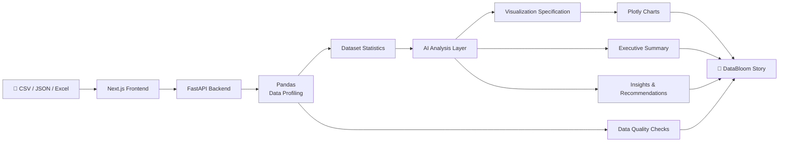

<div align="center">

# 🌸 DataBloom

### Turn raw data into a story people can understand.

**AI-powered data analysis, visualization, and storytelling — without needing to be a data scientist.**

<br/>

## 🎥 Demo Video

[](https://youtu.be/MMzjMxYymZg)

[](https://my-data-bloom.vercel.app/)
[](https://github.com/komalharshita/DataBloom)
[](#)
[](#)

<br/>


<br/><br/>

**[🚀 Try DataBloom](https://my-data-bloom.vercel.app/)** · **[💻 View Source](https://github.com/komalharshita/DataBloom)**

</div>

---

## 🌱 What is DataBloom?

DataBloom is an **AI Data Storyteller** that helps turn raw datasets into understandable stories.

Working with data often isn't difficult because the data is unavailable — it's difficult because understanding **what the data is actually saying** takes time, technical knowledge, and experience.

DataBloom is designed to make that first step easier.

Upload a **CSV, JSON, or Excel file**, ask a question in plain English, and DataBloom analyzes the dataset, identifies meaningful patterns, selects useful visualizations, and turns the results into an explanation that is easier to understand.

Instead of giving users a wall of numbers or expecting them to manually build charts, DataBloom brings together:

- **Data profiling**
- **AI-assisted analysis**
- **Automatic visualization selection**
- **Plain-English insights**
- **Recommendations and next steps**
- **Data-quality checks**

The idea is simple:

> **Don't just show people the data. Help them understand the story inside it.**

DataBloom was built for the **Hyperbloom September – AI/ML Hackathon**, with a focus on making AI useful in a practical data-analysis workflow.

---

## The Experience

```text
        📁 Upload Data
              │
              ▼
      ┌─────────────────┐
      │  Data Profiler   │
      │  Schema + Stats  │
      └────────┬────────┘
               │
               ▼
      ┌─────────────────┐
      │   AI Analyst     │
      │ Patterns + Ideas │
      └────────┬────────┘
               │
               ▼
      ┌─────────────────┐
      │ Visualization   │
      │ Chart Selection │
      └────────┬────────┘
               │
               ▼
      ┌─────────────────┐
      │  Data Story      │
      │ Insights + Why   │
      └─────────────────┘
```

### From raw rows → to a readable story.

---

## 🖥️ Product Preview

> Add your actual screenshots to `docs/images/` and update the filenames below.

### Landing Page

<p align="center">
  
</p>

### Start with Your Data

<p align="center">
  
</p>

### AI Data Story

<p align="center">
  
</p>

---

## Why DataBloom?

Traditional data analysis often has a steep gap between:

**Raw Data**

→ spreadsheets  
→ columns  
→ numbers  
→ filters  
→ manual charts  

and

**Understanding**

→ patterns  
→ trends  
→ anomalies  
→ decisions  
→ actions

DataBloom tries to reduce that gap.

The goal isn't to replace analysts or data scientists.

It's to make **the first conversation with a dataset much easier**.

---

## 🧠 What DataBloom Does

### 01 · Upload

Drop in a dataset in a familiar format:

- `.csv`
- `.json`
- `.xls`
- `.xlsx`

### 02 · Ask

Ask a question using normal language.

For example:

> "Which region generated the most revenue?"

or

> "What are the biggest operational bottlenecks?"

### 03 · Analyze

DataBloom profiles the dataset and combines deterministic data processing with AI-assisted interpretation.

### 04 · Visualize

Instead of forcing every dataset into the same chart, DataBloom identifies visualizations that make sense for the question and data.

### 05 · Explain

The result isn't just a chart.

DataBloom provides:

- Executive summary
- Key metrics
- Charts
- Chart rationale
- Key insights
- Data-quality observations
- Recommendations

---

## Core Features

| Feature | What it does |
|---|---|
| 📂 Multi-format Upload | Supports CSV, JSON and Excel datasets |
| 🔎 Data Profiling | Understands columns, types, missing values and basic statistics |
| 💬 Natural Language Questions | Ask questions without writing SQL |
| 🤖 AI Analysis | Uses an LLM to interpret patterns and generate analytical reasoning |
| 📊 Smart Visualization | Selects appropriate chart types for the data |
| 📖 Data Storytelling | Converts analytical output into understandable explanations |
| 🛡️ Validation | Uses deterministic processing to keep numerical analysis grounded |
| 💡 Recommendations | Suggests practical next steps based on findings |
| 🎨 Interactive Charts | Uses Plotly for interactive data exploration |
| 📱 Responsive UI | Designed for desktop and smaller screens |

---

# Architecture

DataBloom intentionally separates **what should be deterministic** from **what benefits from AI**.



### The principle

**Code handles facts.  
AI handles interpretation.**

The application uses deterministic Python processing for things such as dataset parsing, profiling, statistics and validation.

The AI layer is used for tasks where interpretation and natural-language reasoning are useful — such as identifying what is interesting, deciding how to explain it, and suggesting appropriate visualizations.

This helps reduce the risk of allowing an LLM to freely invent numerical results.

---

# 🛠️ Tech Stack

### Frontend

- **Next.js**
- **React**
- **TypeScript**
- **Tailwind CSS**
- **shadcn/ui**
- **Motion**
- **Lenis**
- **Plotly**

### Backend

- **Python**
- **FastAPI**
- **Pandas**
- **Pydantic**
- **Uvicorn**

### AI

- **OpenAI API**
- LLM-assisted analytical interpretation
- Natural-language data storytelling
- Visualization reasoning

### Deployment

- **Vercel** — Frontend
- **Render** — Backend

---

## 🤖 AI Workflow

DataBloom doesn't treat AI as a chatbot placed on top of a dashboard.

AI is part of the analytical workflow.

```text
Dataset
   │
   ▼
Profile the data
   │
   ▼
Understand the user's question
   │
   ▼
Identify meaningful patterns
   │
   ▼
Choose useful visualizations
   │
   ▼
Explain the findings
   │
   ▼
Generate a coherent data story
```

### Why this approach?

A language model is good at:

- understanding natural language
- identifying interesting relationships
- explaining technical findings
- generating human-readable narratives
- reasoning about visualization choices

Traditional code is better at:

- parsing files
- calculating statistics
- validating values
- handling structured data
- rendering charts reliably

DataBloom combines both.

---

# 📊Visualization Philosophy

One of the ideas behind DataBloom is:

> **A chart should have a reason to exist.**

Instead of simply generating a collection of random charts, DataBloom connects each visualization to an analytical purpose.

For every visualization, the user can understand:

### What is being shown?

The actual data relationship represented by the chart.

### Why this chart?

The reasoning behind selecting that visualization.

### What should I notice?

The important pattern or takeaway.

This turns visualization from:

**"Here is a chart."**

into:

**"Here is the chart that helps answer your question — and here's why."**

---

# Sample Datasets

DataBloom also includes curated sample datasets so users can explore the experience without preparing their own data first.

### 💰 Sales & Revenue

Explore:

- Revenue trends
- Regional performance
- Product performance
- Sales patterns

### 🚚 Logistics & Operations

Explore:

- Delivery performance
- Operational bottlenecks
- Delays
- Regional logistics patterns

### 👥 People & HR

Explore:

- Workforce trends
- Department patterns
- Employee metrics
- Organizational insights

These samples make it possible to experience the complete DataBloom workflow immediately.

---

# Data Quality

Data storytelling is only useful when the underlying numbers can be trusted.

DataBloom therefore treats data quality as part of the analytical result rather than an afterthought.

The workflow can surface things such as:

- Missing values
- Inconsistent fields
- Potentially problematic columns
- Dataset limitations
- Statistical observations that should be interpreted carefully

The broader design principle is:

> **Don't hide uncertainty. Surface it.**

---

# Responsible AI Design

DataBloom is designed around a simple distinction:

### Deterministic layer

Used for:

- File parsing
- Data types
- Dataset profiling
- Statistical calculations
- Validation
- Chart rendering

### AI layer

Used for:

- Analytical interpretation
- Natural-language understanding
- Visualization reasoning
- Insight generation
- Storytelling
- Recommendations

This separation makes the system easier to reason about and debug.

---

# 🚀 Running Locally

## 1. Clone the repository

```bash
git clone https://github.com/komalharshita/DataBloom.git

cd DataBloom
```

---

## 2. Start the backend

```bash
cd backend

python -m venv venv
```

### Windows

```bash
venv\Scripts\activate
```

### macOS / Linux

```bash
source venv/bin/activate
```

Install dependencies:

```bash
pip install -r requirements.txt
```

Create your environment file:

```bash
cp .env.example .env
```

Add your OpenAI API key:

```env
OPENAI_API_KEY=your_openai_api_key
OPENAI_MODEL=gpt-4o-mini
ALLOWED_ORIGINS=http://localhost:3000
```

Start FastAPI:

```bash
uvicorn main:app --reload
```

Backend:

```text
http://localhost:8000
```

---

## 3. Start the frontend

Open another terminal:

```bash
cd frontend

npm install
```

Create `.env.local`:

```env
NEXT_PUBLIC_API_URL=http://localhost:8000
```

Start the development server:

```bash
npm run dev
```

Open:

```text
http://localhost:3000
```

---

# 🏆 Built for Hyperbloom

DataBloom was created for the **Hyperbloom September – AI/ML Hackathon**.

The project focuses on combining practical AI with data analysis to make insights more accessible.

### The core idea

> **Raw data shouldn't require a data science background to become useful.**

---

# 👤 Team

### Komal Harshita

**Solo Developer & Creator**

Responsible for:

- Product concept
- UX/UI design
- Frontend development
- Backend development
- AI integration
- Data pipeline
- Visualization workflow
- Deployment
- Documentation

---

# 🤖 AI Tools Disclosure

AI tools were used throughout the development process as **engineering, research, data-generation, and iteration assistants**.

### Adaptation AI Labs

Used to help create and augment the project's sample dataset.

Specifically:

- Created a sample dataset using Adaptation AI Labs
- Used the **Data Scientist** feature to augment the dataset
- Used the resulting data as part of the DataBloom development and demonstration workflow

### ChatGPT

Used as a development and product-thinking assistant for:

- Architecture planning
- Product ideation
- UX/UI exploration
- Prompt engineering
- Debugging assistance
- Documentation
- Deployment troubleshooting
- Feature planning
- Code-generation guidance

### GitHub Copilot

Used as an engineering assistant for:

- Implementing frontend components
- Backend development
- Refactoring
- Debugging
- TypeScript/Python assistance
- Deployment-related fixes
- Iterating on existing code

### Antigravity

Used as an AI-assisted development environment during the implementation and iteration of the project.

---

## 🧩 AI Assistance Philosophy

AI was used to **accelerate development**, not replace the core product thinking.

The final application architecture, product direction, visual identity, workflow decisions, and feature prioritization were shaped around the goal of making data analysis easier to understand.

---

# 💭 What I Learned

Building DataBloom taught me that making an AI product isn't just about putting an LLM behind an interface.

A few things became especially clear during the project:

### 1. AI features need structure

Giving an LLM a dataset and asking it to "analyze everything" isn't enough.

The surrounding system matters.

### 2. Grounding matters

If an AI system talks about numbers, the numbers should come from the data — not from what the model thinks the data probably contains.

### 3. Visualization is part of the explanation

Choosing a chart is itself an analytical decision.

### 4. Deployment is part of building

A project can work perfectly on localhost and still fail in production because of environment variables, API URLs, CORS, or backend configuration.

### 5. Simplicity is a feature

The goal wasn't to build another complicated analytics platform.

It was to make the first interaction with a dataset feel easier.

---

# What's Next?

Some directions I'd like to explore in future versions:

- More advanced analytical workflows
- Better anomaly detection
- More visualization types
- Dataset comparison
- Conversational follow-up questions
- Exportable data stories
- More robust validation
- Deeper statistical analysis
- Personalized analytical recommendations

---

# Project Links

| Resource | Link |
|---|---|
| 🌸 Live MVP | [my-data-bloom.vercel.app](https://my-data-bloom.vercel.app/) |
| 💻 GitHub | [github.com/komalharshita/DataBloom](https://github.com/komalharshita/DataBloom) |
| ⚡ Backend API | [databloom.onrender.com](https://databloom.onrender.com/) |

---

<div align="center">

## 🌸 DataBloom

**Turn raw data into a story people can understand.**

Built with curiosity, code, and a lot of iteration.

<br/>

⭐ **If you find the project interesting, consider starring the repository.**

<br/>

**Made by Komal Harshita**

</div>
